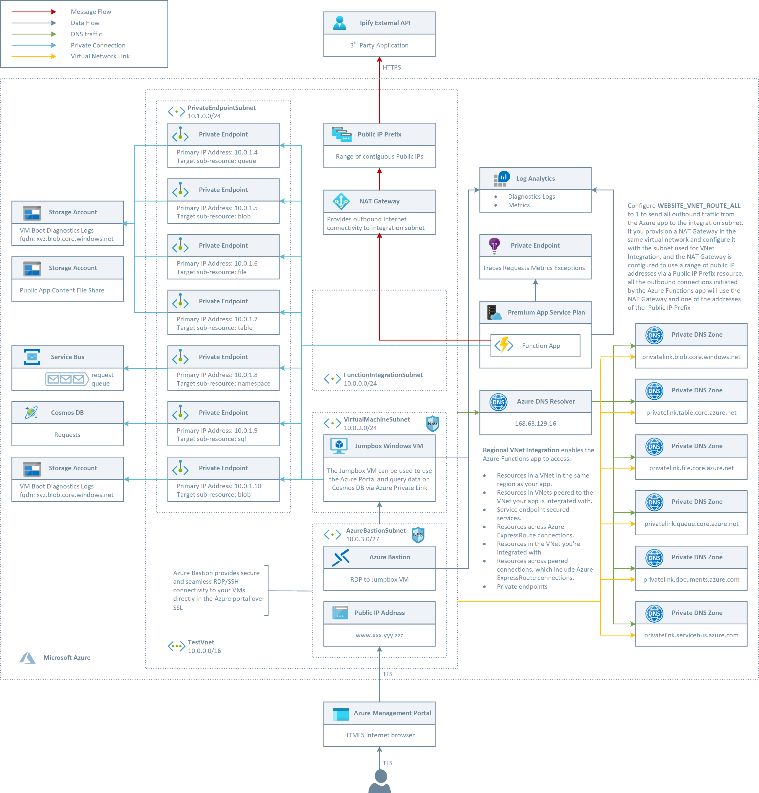
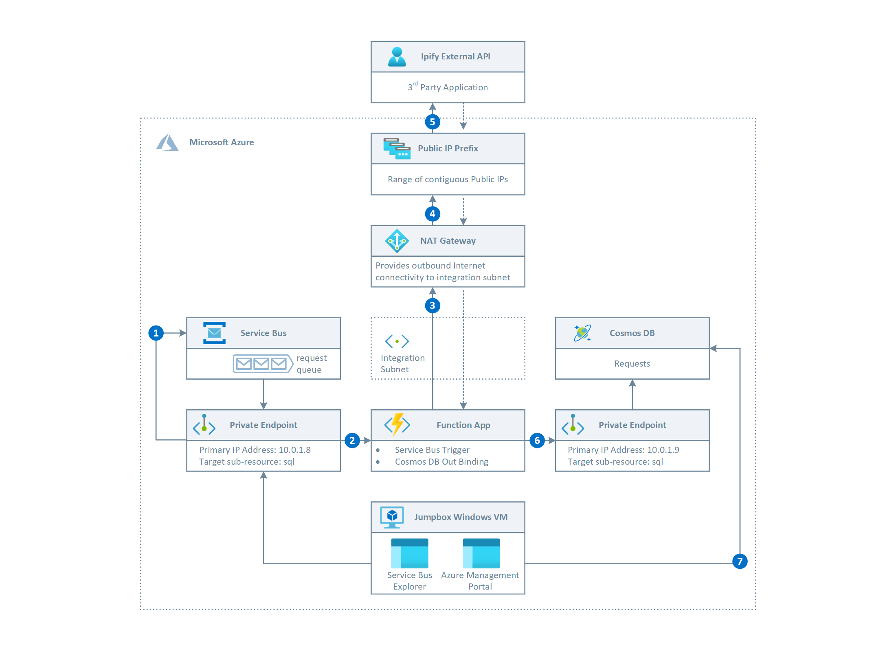
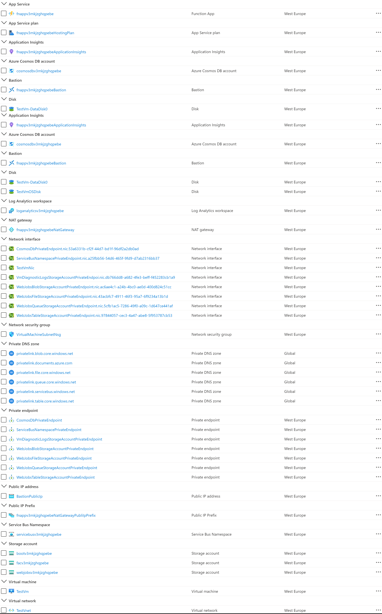
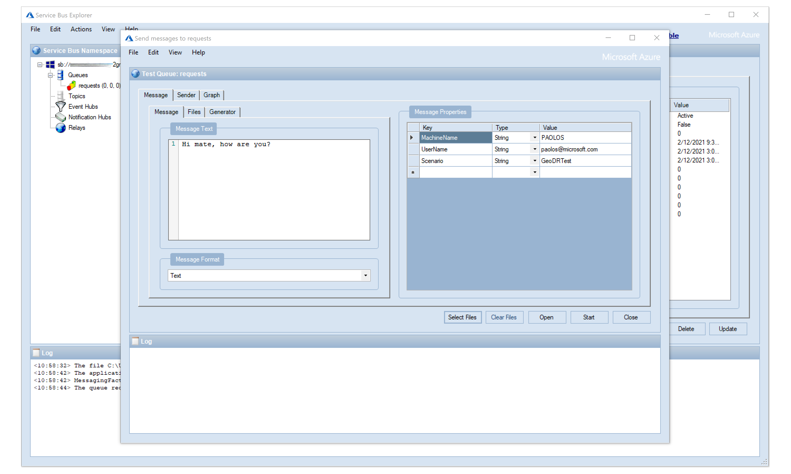
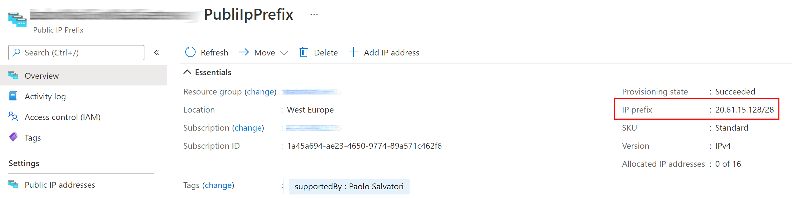

# How to use Private Endpoints and NAT Gateway with Azure Functions


This sample shows how to use [Azure Private Endpoints](https://docs.microsoft.com/azure/private-link/private-endpoint-overview) and [NAT Gateway](https://docs.microsoft.com/en-us/azure/virtual-network/nat-gateway-resource) from an Azure Functions app deployed to an [Azure Functions Premium Plan](https://docs.microsoft.com/en-us/azure/azure-functions/functions-premium-plan?tabs=portal) with [Regional VNET Integration](https://docs.microsoft.com/en-us/azure/app-service/web-sites-integrate-with-vnet#regional-vnet-integration).

## Deploy to Azure

You can use the following button to deploy the demo to your Azure subscription:

[](https://portal.azure.com/#create/Microsoft.Template/uri/https%3A%2F%2Fraw.githubusercontent.com%2FAzure-Samples%2FAzure-Functions-Private-Endpoints%2Fmaster%2Ftemplate%2Fazuredeploy.json%3Ftoken%3DAAIW4AOWATWNQLL2JZKDBAK63EOOU)

## Architecture

The following picture shows the architecture and network topology of the sample.



The ARM template deploys the following resources:

- Virtual Network: this virtual network is composed of the following subnets:
  - **FunctionSubnet**: this subnet is used for the regional VNET integration with the Azure Function app hosted by a Premium Plan. For more information, see [Tutorial: integrate Functions with an Azure virtual network](https://docs.microsoft.com/en-us/azure/azure-functions/functions-create-vnet)
  - **PrivateEndpointSubnet**: hosts the private endpoints used by the application.
  - **VirtualMachineSubnet**: hosts the Jumpbox virtual machine and any additional virtual machine used by the solution.
  - **AzureBastionSubnet**: hosts Azure Bastion. For more information, see [Working with NSG access and Azure Bastion](https://docs.microsoft.com/en-us/azure/bastion/bastion-nsg).
- Network Security Group: this resource contains an inbound rule to allow access to the jumpbox virtual machine on port 3389 (RDP)
- A Windows 10 virtual machine. This virtual machine can be used as jumpbox virtual machine to access the Azure resources, such as the Service Bus namespace and Cosmos DB, exposed via [Azure Private Link](https://docs.microsoft.com/en-us/azure/private-link/private-link-overview) as the default access to their public endpoints is denied. As an alternative to using the jumpbox virtual machine, you can create an IP Firewall rule to allow access from your local computer. For more information, see [Configure IP firewall in Azure Cosmos DB](https://docs.microsoft.com/en-us/azure/cosmos-db/how-to-configure-firewall)
- A Public IP for Azure Bastion
- Azure Bastion is used to access the jumpbox virtual machine from the Azure Portal via RDP. For more information, see [What is Azure Bastion?](https://docs.microsoft.com/en-us/azure/bastion/bastion-overview).
- An ADLS Gen 2 storage account used to store the boot diagnostics logs of the virtual machine as blobs
- An ADLS Gen 2 storage account used by Azure Functions for key management, timer trigger management, and Event Hubs checkpoints. The storage account must be a general-purpose one that supports blobs, queues, and tables. For more information, see [AzureWebJobsStorage](https://docs.microsoft.com/it-it/azure/azure-functions/functions-app-settings#azurewebjobsstorage).
- An ADLS Gen 2 storage account where the function app code and configuration are stored in event-driven scaling plans running on Windows. For more information, see [WEBSITE_CONTENTAZUREFILECONNECTIONSTRING](https://docs.microsoft.com/it-it/azure/azure-functions/functions-app-settings#website_contentazurefileconnectionstring).
- An Azure Function Premium Plan hosting the Azure Function app. For more information, see [Azure Functions Premium Plan](https://docs.microsoft.com/en-us/azure/azure-functions/functions-premium-plan?tabs=portal).
- An Azure Functions app containing a single function that:
  - reads messages from a Service Bus queue.
  - invokes the [ipify](https://api.ipify.org) external service via the NAT gateway to retrieve its public IP.
  - stores the original message enriched with the public IP address retrieved from ipify to a Cosmos DB database.
- An Application Insights resource used by the Azure Functions app to store logs, traces, requests, exceptions and metrics. For more information, see [Monitor Azure Functions](https://docs.microsoft.com/en-us/azure/azure-functions/functions-monitoring).
- A zone-redundant Premium Service Bus namespace hosting a **requests** queue used by the Azure Functions app to receive messages. For more information, see [What is Azure Service Bus?](https://docs.microsoft.com/en-us/azure/service-bus-messaging/service-bus-messaging-overview).
- An Azure Cosmos used to store enriched messages. DB For more information, see [Welcome to Azure Cosmos DB](https://docs.microsoft.com/en-us/azure/cosmos-db/introduction).
- A private endpoint to all the storage accounts, Service Bus namespace, and Cosmos DB account.
- A Private DNS Zone Group to link each private endpoint with the corresponding Private DNS Zone.
- The NIC used by the jumpbox virtual machine and for each private endpoint to storage accounts, Service Bus namespace, or Cosmos DB account.
- A NAT Gateway used by the Azure Functions app for the outbound connections from the integration subnet. For more information, see [Designing virtual networks with NAT gateway resources](https://docs.microsoft.com/en-us/azure/virtual-network/nat-gateway-resource).
- A Public IP Address Prefix providing a contiguous range of public IP addresses to the NAT Gateway. For more information, see [Public IP address prefix](https://docs.microsoft.com/en-us/azure/virtual-network/public-ip-address-prefix) and [Designing virtual networks with NAT gateway resources](https://docs.microsoft.com/en-us/azure/virtual-network/nat-gateway-resource).
- A Log Analytics workspace used to monitor the health status of the services such as the hosting plan or NSG.
- A Private DNS Zone for File Storage Account private endpoints (privatelink.file.core.windows.net)
- A Private DNS Zone for Blob Storage Account private endpoints (privatelink.blob.core.windows.net)
- A Private DNS Zone for Queue Storage Account private endpoints (privatelink.queue.core.windows.net)
- A Private DNS Zone for Table Storage Account private endpoints (privatelink.table.core.windows.net)
- A Private DNS Zone for Service Bus private endpoints (privatelink.servicebus.windows.net)
- A Private DNS Zone for Cosmos DB private endpoints (privatelink.documents.windows.net)

## Message Flow

The following diagram shows the message flow of the demo:



1. Use the Azure Portal or [Service Bus Explorer](https://github.com/paolosalvatori/ServiceBusExplorer) from the jumpbox virtual machine to send a message to the **requests** queue in the Service Bus namespace via the private endpoint. As an alternative, you can create an IP Firewall rule to allow access to the Service Bus namespace from your computer and send messages from it. For more information, see [Allow access to Azure Service Bus namespace from specific IP addresses or ranges](https://docs.microsoft.com/en-us/azure/service-bus-messaging/service-bus-ip-filtering).
2. The message is received by the Azure Function via the private endpoint using the [Azure Service Bus Trigger for Azure Functions](https://docs.microsoft.com/en-us/azure/azure-functions/functions-bindings-service-bus-trigger?tabs=csharp).
3. The Function invokes the [ipify](https://api.ipify.org) external service to retrieve its public IP address. The WEBSITE_VNET_ROUTE_ALL setting of the Azure Functions app is set to 1, hence all of the outbound traffic from the Azure Functions is routed through the integration subnet. If you route all of the outbound calls from the Azure Functions app into the integration VNet, the traffic will be subject to the NSGs and UDRs that are applied to the integration subnet. For more information, see [Regional virtual network integration](https://docs.microsoft.com/en-us/azure/azure-functions/functions-networking-options#regional-virtual-network-integration). When you route all of the outbound traffic from the Azure Functions app into the integration VNet, and the subnet is not configured to use a NAT gateway, the outbound addresses are still the outbound addresses that are listed in your app properties unless you provide routes to send the traffic elsewhere. In this case, you need to pay attention to avoid SNAT ports exhaustion issue. For more information, see [SNAT with App Service](https://4lowtherabbit.github.io/blogs/2019/10/SNAT/) and [Manage connections in Azure Functions](https://docs.microsoft.com/en-us/azure/azure-functions/manage-connections).
4. The integration subnet is configured to use a NAT Gateway for outbound connections, hence all the calls from the Azure Functions app to any external service go through the NAT Gateway. The NAT Gateway solves another problem beyond providing a dedicated internet address. You can also now have 64k outbound SNAT ports usable by your apps. One of the challenges in the App Service is the limit on the number of connections you can have to the same address and port. There are more details on this problem in the [Troubleshooting intermittent outbound connection errors guide](https://docs.microsoft.com/azure/app-service/troubleshoot-intermittent-outbound-connection-errors). To use a NAT Gateway with your app, you need to

   - Configure Regional Vnet Integration with your app as described in Integrate your app with an Azure virtual network
   - Route all the outbound traffic into your Azure virtual network
   - Provision a NAT Gateway in the same virtual network and configure it with the subnet used for VNet Integration. For more information on this topology, see [NAT Gateway and app integration](https://azure.github.io/AppService/2020/11/15/web-app-nat-gateway.html)
5. If a public IP prefix resource is used with a NA Gateway, all the IP addresses of the Public IP Prefix resource are consumed by a NAT gateway resource. In our sample, every outbound call via HTTPS from the Azure Function to the [ipify](https://api.ipify.org) external service will use one of the public IP addresses of the prefix.
6. The Azure Function stores the message received from the Service Bus enriched with the public IP address received from the [ipify](https://api.ipify.org) external service to the Cosmos DB database via private endpoint.
7. You can use the Azure Portal from the jumpbox virtual machine to query data in the Cosmos DB database using Data Explorer. For more information, see [Work with data using Azure Cosmos DB Explorer](https://docs.microsoft.com/en-us/azure/cosmos-db/data-explorer). As an alternative, you can create an IP Firewall rule to allow access from your local computer and run queries from it. For more information, see [Configure IP firewall in Azure Cosmos DB](https://docs.microsoft.com/en-us/azure/cosmos-db/how-to-configure-firewall)

## Prerequisites

The following components are required to run this sample:

- [.NET Core 3.1](https://dotnet.microsoft.com/download/dotnet-core/3.1)
- [Visual Studio Code](https://code.visualstudio.com/)
- [Azure CLI](https://docs.microsoft.com/cli/azure/install-azure-cli?view=azure-cli-latest)
- [Azure Functions Core Tools](https://docs.microsoft.com/azure/azure-functions/functions-run-local)
- [Azure subscription](https://azure.microsoft.com/free/)

### Options

You can use the [Azure Cosmos DB Emulator](https://docs.microsoft.com/azure/cosmos-db/local-emulator) and [Azure Storage Emulator](https://docs.microsoft.com/azure/storage/common/storage-use-emulator), along with the Azure Functions Core Tools, if you wish to develop and test locally.

### Deployment

You can use the ARM template and Bash script included in the sample to deploy to Azure the entire infrastructure necessary to host the demo:

```sh
#!/bin/bash

# Variables
resourceGroupName="<your-resource-group-name>"
location="<your-favorite-location>"
deploy=1

# ARM template and parameters files
template="../templates/azuredeploy.json"
parameters="../templates/azuredeploy.parameters.json"

# SubscriptionId of the current subscription
subscriptionId=$(az account show --query id --output tsv)
subscriptionName=$(az account show --query name --output tsv)

# Check if the resource group already exists
createResourceGroup() {
    local resourceGroupName=$1
    local location=$2

    # Parameters validation
    if [[ -z $resourceGroupName ]]; then
        echo "The resource group name parameter cannot be null"
        exit
    fi

    if [[ -z $location ]]; then
        echo "The location parameter cannot be null"
        exit
    fi

    echo "Checking if [$resourceGroupName] resource group actually exists..."

    if ! az group show --name "$resourceGroupName" &>/dev/null; then
        echo "No [$resourceGroupName] resource group actually exists"
        echo "Creating [$resourceGroupName] resource group..."

        # Create the resource group
        if az group create --name "$resourceGroupName" --location "$location" 1>/dev/null; then
            echo "[$resourceGroupName] resource group successfully created"
        else
            echo "Failed to create [$resourceGroupName] resource group"
            exit
        fi
    else
        echo "[$resourceGroupName] resource group already exists"
    fi
}

# Validate the ARM template
validateTemplate() {
    local resourceGroupName=$1
    local template=$2
    local parameters=$3
    local arguments=$4

    # Parameters validation
    if [[ -z $resourceGroupName ]]; then
        echo "The resource group name parameter cannot be null"
    fi

    if [[ -z $template ]]; then
        echo "The template parameter cannot be null"
    fi

    if [[ -z $parameters ]]; then
        echo "The parameters parameter cannot be null"
    fi

    echo "Validating [$template] ARM template..."

    if [[ -z $arguments ]]; then
        error=$(az deployment group validate \
            --resource-group "$resourceGroupName" \
            --template-file "$template" \
            --parameters "$parameters" \
            --query error \
            --output json)
    else
        error=$(az deployment group validate \
            --resource-group "$resourceGroupName" \
            --template-file "$template" \
            --parameters "$parameters" \
            --arguments $arguments \
            --query error \
            --output json)
    fi

    if [[ -z $error ]]; then
        echo "[$template] ARM template successfully validated"
    else
        echo "Failed to validate the [$template] ARM template"
        echo "$error"
        exit 1
    fi
}

# Deploy ARM template
deployTemplate() {
    local resourceGroupName=$1
    local template=$2
    local parameters=$3
    local arguments=$4

    # Parameters validation
    if [[ -z $resourceGroupName ]]; then
        echo "The resource group name parameter cannot be null"
        exit
    fi

    if [[ -z $template ]]; then
        echo "The template parameter cannot be null"
        exit
    fi

    if [[ -z $parameters ]]; then
        echo "The parameters parameter cannot be null"
        exit
    fi

    if [ $deploy != 1 ]; then
        return
    fi

    # Deploy the ARM template
    echo "Deploying [$template$] ARM template..."

    if [[ -z $arguments ]]; then
         az deployment group create \
            --resource-group $resourceGroupName \
            --template-file $template \
            --parameters $parameters 1>/dev/null
    else
         az deployment group create \
            --resource-group $resourceGroupName \
            --template-file $template \
            --parameters $parameters \
            --parameters $arguments 1>/dev/null
    fi

    if [[ $? == 0 ]]; then
        echo "[$template$] ARM template successfully provisioned"
    else
        echo "Failed to provision the [$template$] ARM template"
        exit -1
    fi
}

# Create Resource Group
createResourceGroup \
    "$resourceGroupName" \
     "$location"

# Validate ARM Template
validateTemplate \
    "$resourceGroupName" \
    "$template" \
    "$parameters"

# Deploy ARM Template
deployTemplate \
    "$resourceGroupName" \
    "$template" \
    "$parameters"
```

The following figure shows the Azure resources grouped by type deployed by the ARM template in the target resource group.



### Deploy the Azure Function code

Once the Azure resources have been deployed to Azure (which can take about 10-12 minutes), you need to deploy the Azure Function contained in the src folder to the newly created Azure Function app. You can use Visual Studio to deploy the Azure Function app to Azure. For more information, see [Develop Azure Functions using Visual Studio](https://docs.microsoft.com/en-us/azure/azure-functions/functions-develop-vs). As an alternative, you can use the [Azure Functions Core Tools](https://docs.microsoft.com/azure/azure-functions/functions-run-local?tabs=windows%2Ccsharp%2Cbash#publish) to deploy the application, as shown in the code snippet below:

```azurecli
func azure functionapp publish [YOUR-FUNCTION-APP-NAME]
```

Below you can read the code of the Azure Function. The code of the Azure Function makes use of the dependency injection (DI) software design pattern, which is a technique to achieve [Inversion of Control (IoC)](https://docs.microsoft.com/en-us/dotnet/standard/modern-web-apps-azure-architecture/architectural-principles#dependency-inversion) between classes and their dependencies.

- Dependency injection in Azure Functions is built on the .NET Core Dependency Injection features. Familiarity with [.NET Core dependency injection](https://docs.microsoft.com/en-us/aspnet/core/fundamentals/dependency-injection) is recommended. There are differences in how you override dependencies and how configuration values are read with Azure Functions on the Consumption plan.
- Support for dependency injection begins with Azure Functions 2.x.

For more information, see [Use dependency injection in .NET Azure Functions](https://docs.microsoft.com/en-us/azure/azure-functions/functions-dotnet-dependency-injection#register-services).

```csharp
using System;
using System.Text;
using System.Net.Http;
using System.Threading.Tasks;
using Microsoft.Extensions.Logging;
using Microsoft.Azure.WebJobs;
using Microsoft.Azure.ServiceBus;
using Microsoft.Extensions.DependencyInjection;
using Microsoft.Azure.Functions.Extensions.DependencyInjection;

[assembly: FunctionsStartup(typeof(Microsoft.Azure.Samples.Startup))]

namespace Microsoft.Azure.Samples
{
    public class Startup : FunctionsStartup
    {
        public override void Configure(IFunctionsHostBuilder builder)
        {
            builder.Services.AddHttpClient();
        }
    }
    
    public class RequestReceiver
    {
        #region Private Constants
        private const string IpifyUrl = "https://api.ipify.org";
        private const string Unknown = "UNKNOWN";
        private const string Empty = "EMPTY";
        #endregion


        #region Private Instance Fields
        private readonly HttpClient httpClient;
        #endregion

        #region Private Static Fields
        private static string queueName = Environment.
                                          GetEnvironmentVariable("ServiceBusQueueName", 
                                          EnvironmentVariableTarget.Process);
        #endregion

        #region Public Constructor
        public RequestReceiver(HttpClient httpClient)
        {
            this.httpClient = httpClient;
        } 
        #endregion

        [FunctionName("ProcessRequest")]
        public async Task Run([ServiceBusTrigger("%ServiceBusQueueName%", 
                              Connection = "ServiceBusConnectionString")] Message message,
                              [CosmosDB(databaseName: "%CosmosDbName%", 
                              collectionName:"%CosmosDbCollectionName%", 
                              ConnectionStringSetting = "CosmosDBConnection")] 
                              IAsyncCollector<CustomMessage> items,
                              ILogger log,
                              ExecutionContext executionContext)
        {
            try
            {
                // Validate the incoming message
                if (message == null)
                {
                    return;
                }

                // Log message
                log.LogInformation($"Started '{executionContext.FunctionName}' " + 
                                   $"(Running, Id={executionContext.InvocationId}) " +
                                   $"A message with Id={message.MessageId ?? Empty} " + 
                                   $"has been received from the {queueName} queue");

                // Initialize data
                var messageId = string.IsNullOrEmpty(message.MessageId) ? 
                                Guid.NewGuid().ToString() : 
                                message.MessageId;
                var text = Encoding.UTF8.GetString(message.Body) ?? Empty;
                var publicIpAddress = Unknown;
                
                // Retrieve the public IP from Ipify site
                try
                {
                    var response = await httpClient.GetAsync(IpifyUrl);

                    if (response.IsSuccessStatusCode)
                    {
                        publicIpAddress = await response.Content.ReadAsStringAsync();

                        // Log message
                        log.LogInformation($"Running '{executionContext.FunctionName}' " +
                                           $"(Running, Id={executionContext.InvocationId}) " +
                                           $"Call to {IpifyUrl} returned {publicIpAddress}");
                    }
                }
                catch (Exception ex)
                {
                    log.LogError(ex, $"Error '{executionContext.FunctionName}' " +
                                     $"(Running, Id={executionContext.InvocationId}) " +
                                     $"An error occurred while calling {IpifyUrl}: {ex.Message}");
                }

                // Initialize message
                var customMessage = new CustomMessage
                {
                    Id = messageId,
                    Message = text,
                    Properties = new Dictionary<string, object>(message.UserProperties),
                    PublicIpAddress = publicIpAddress
                };

                // Store the message to Cosmos DB
                await items.AddAsync(customMessage);
                log.LogInformation($"Completed '{executionContext.FunctionName}' " +
                                   $"(Running, Id={executionContext.InvocationId}) "+
                                   $"The message with Id={message.MessageId ?? Empty} " +
                                   $"has been successfully stored to Cosmos DB");
            }
            catch (Exception ex)
            {
                log.LogError(ex, $"Failed '{executionContext.FunctionName}' " +
                                 $"(Running, Id={executionContext.InvocationId}) {ex.Message}");
                throw;
            }
        }
    }

    public class CustomMessage
    {
        [JsonProperty(PropertyName = "id")]
        public string Id { get; set; }

        [JsonProperty(PropertyName = "message")]
        public string Message { get; set; }

        [JsonProperty(PropertyName = "properties")]
        public Dictionary<string, object> Properties { get; set; }

        [JsonProperty(PropertyName = "publicIpAddress")]
        public string PublicIpAddress { get; set; }
    }
}
```

As an alternative, you can use a static, singleton instance of the HttpClient object to call the external ipify service via HTTPS. To avoid holding more connections than necessary, we suggest reusing client instances rather than creating new ones with each function invocation. We recommend reusing client connections for any language that you might write your function in. For example, .NET clients like the HttpClient, DocumentClient, and Azure Storage clients can manage connections if you use a single, static client. For more information, see [https://docs.microsoft.com/en-us/azure/azure-functions/manage-connections#static-clients](https://docs.microsoft.com/en-us/azure/azure-functions/manage-connections#client-code-examples).

**Note**: when debugging the Azure Function locally, make sure to replace the placeholders in the `local.settings.json` file with a valid connection string for the storage account, Service Bus namespace, and Cosmos DB account.

## Run the sample

You can proceed as follows to run the sample:

1. Connect to the jumpbox virtual machine using Azure Bastion
2. Use the [Service Bus Explorer](https://docs.microsoft.com/en-us/azure/service-bus-messaging/explorer) integrated into the Azure Portal or download and use the [Service Bus Explorer](https://github.com/paolosalvatori/ServiceBusExplorer) tool to send one or more messages to the **requests** queue in the Service Bus namespace. In the latter case, you can retrieve the connection string of the Service Bus namespace from the Azure Portal.


3. If you use the [Service Bus Explorer](https://github.com/paolosalvatori/ServiceBusExplorer) tool, send a batch of 1000 messages in a single shot to simulate a traffic burst.
4. You can run the following query in Data Explorer to retrieve the list of public IP addresses used by the Azure Functions app to invoke the [ipify](https://api.ipify.org) external service. You will notice that they all belong to the Public IP Address Prefix resource used by the NAT Gateway.

```sql
SELECT DISTINCT VALUE m.publicIpAddress FROM Messages m
```

In case of failure of the call to the external service, the Azure Functions app sets the value of the public IP address to `UNKNOWN`. As you can see below, none of the calls to the external service returned an error, all of them used one of the 16 public IP addresses provided by the NAT Gateway and Public IP Address Prefix.

```json
[
    "20.61.15.136",
    "20.61.15.140",
    "20.61.15.141",
    "20.61.15.133",
    "20.61.15.131",
    "20.61.15.143",
    "20.61.15.134",
    "20.61.15.129",
    "20.61.15.142",
    "20.61.15.135",
    "20.61.15.139",
    "20.61.15.130",
    "20.61.15.132",
    "20.61.15.138",
    "20.61.15.128",
    "20.61.15.137"
]
```

Below you can see the public IP address range in CIDR notation of the Public IP Address Prefix resource used by the NAT Gateway.



The Public IP Address Prefix includes 16 public IP addresses that go from `20.61.15.128` to `20.61.15.143`. For more information, see [CIDR Notation](https://en.wikipedia.org/wiki/Classless_Inter-Domain_Routing#:~:text=CIDR%20notation%20is%20a%20compact,bits%20in%20the%20network%20mask.).

You can also use the following query to retrieve how many outbound calls were made with each public IP address provided by the Public IP Address Prefix:

```sql
SELECT m.publicIpAddress,  COUNT(m.publicIpAddress) FROM Messages m GROUP BY m.publicIpAddress
```

The query should return something like this:

```json
[
    {
        "publicIpAddress": "20.61.15.137",
        "$1": 83
    },
    {
        "publicIpAddress": "20.61.15.128",
        "$1": 87
    },
    {
        "publicIpAddress": "20.61.15.138",
        "$1": 177
    },
    {
        "publicIpAddress": "20.61.15.132",
        "$1": 361
    },
    {
        "publicIpAddress": "20.61.15.130",
        "$1": 231
    },
    {
        "publicIpAddress": "20.61.15.139",
        "$1": 185
    },
    {
        "publicIpAddress": "20.61.15.135",
        "$1": 123
    },
    {
        "publicIpAddress": "20.61.15.142",
        "$1": 405
    },
    {
        "publicIpAddress": "20.61.15.129",
        "$1": 266
    },
    {
        "publicIpAddress": "20.61.15.134",
        "$1": 210
    },
    {
        "publicIpAddress": "20.61.15.143",
        "$1": 87
    },
    {
        "publicIpAddress": "20.61.15.131",
        "$1": 379
    },
    {
        "publicIpAddress": "20.61.15.133",
        "$1": 187
    },
    {
        "publicIpAddress": "20.61.15.141",
        "$1": 373
    },
    {
        "publicIpAddress": "20.61.15.140",
        "$1": 299
    },
    {
        "publicIpAddress": "20.61.15.136",
        "$1": 547
    }
]
```
